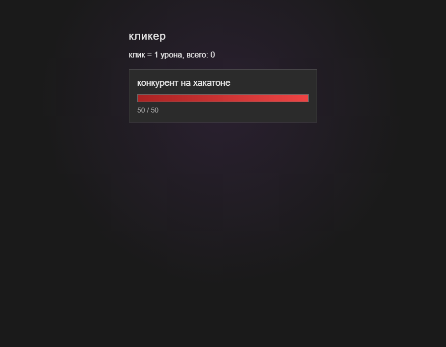
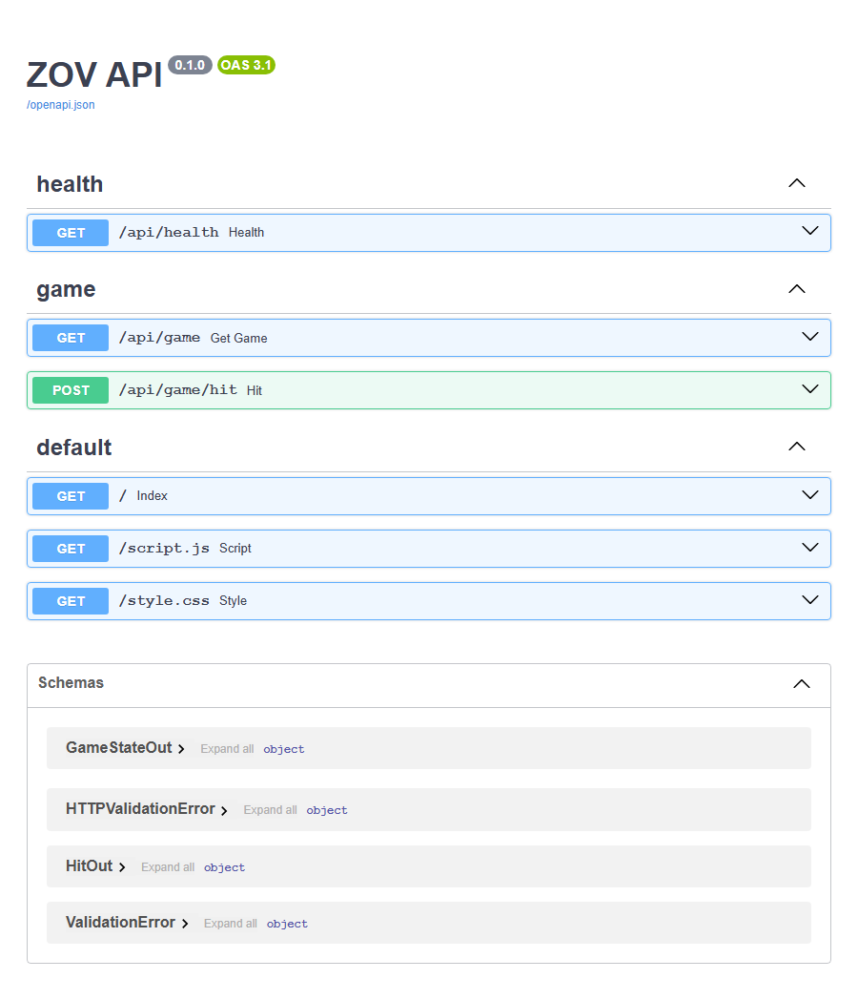
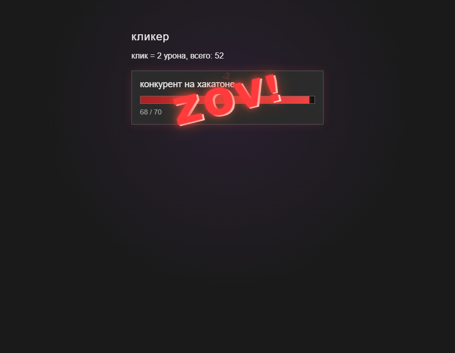

# ZOV

Кликер с FastAPI-бэкендом. Прогресс каждого игрока хранится в SQLite по cookie.

## Быстрый старт

```powershell
cd d:\IC
python -m venv .venv
.\.venv\Scripts\pip install -r requirements.txt
copy .env.example .env
.\.venv\Scripts\alembic upgrade head
python main.py
```

Открыть:

- игра: http://127.0.0.1:8000/
- свагер: http://127.0.0.1:8000/docs

## Скриншоты

### Игра



### Swagger



### ZOV при убийстве босса



## API

| Метод | URL | Описание |
|-------|-----|----------|
| GET | `/api/health` | статус сервера |
| GET | `/api/game` | состояние игрока |
| POST | `/api/game/hit` | удар по боссу |

Игрок определяется cookie `zov_player`.

## БД

Таблица `game_state`:

| Поле | Описание |
|------|----------|
| `player_id` | UUID из cookie |
| `hp` | текущее HP |
| `max_hp` | максимум HP |
| `damage_per_click` | урон за клик |
| `total_damage` | суммарный урон |

## Структура

```
app/          — FastAPI
clicker/      — фронт
alembic/      — миграции
main.py       — запуск сервера
```

## Docker

Файлы `Dockerfile` и `docker-compose.yml` готовы. Запуск Docker:

```powershell
docker compose up --build
```

## Скриншоты для README

```powershell
python main.py
.\.venv\Scripts\python scripts\capture_screenshots.py
```
